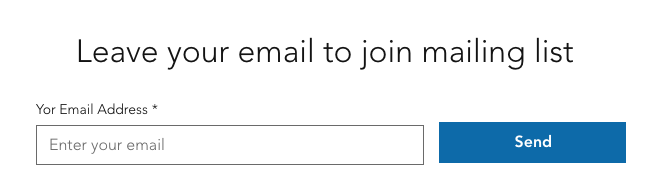

# Emails / Leads Collection App for Wix

- [Add 'Emails / Leads Collection' to your app](https://www.wix.com/market?appMarketParams=eyJhbGciOiJIUzI1NiIsInR5cCI6IkpXVCJ9.eyJkYXRhIjoie1wiYXBwRGVmSWRcIjpcIjNjOGJlYmU3LThiMGEtNGVjNi05ODljLTY4YjdiMTQ4NmI4NFwiLFwiYXBwdXJpXCI6XCJodHRwczovL3d3dy53aXguY29tL2luc3RhbGxlci9pbnN0YWxsP3Rva2VuPTJkOWJmOGQ1MzVlYmE3ZTU5NTAyNjRiOWRkNmE5MWVkNGUzNzFjYjFiYTVhMjdiNjA3N2ZhNTE4ODI1NGM5NWMwM2E5ODNiYmVlZTZkOTYzZDZiNTllY2E5MDRhMGQ5MWM1YzIyYjIzMTg1NTNlZDEyYWQ0YjUwZmI4MTE3N2FhYzBlMzE5MzBhZDAwM2I4YmZhMDFhMTk5YzUyMmUxZjcwNGI1ZWViZGI3ZGQzYmQyZmVlMmMzYjRlNjA5ZTBiNWE1OWE4OTBlMDA3N2ZkZWE0OWU1ZjY5OTczMmQyMDhhZGJjOTUwNzNkZjY1NDA4Yjk3ZmJjMWRiMTUzZjQzOGExYmExYzgwYTc4ZjVjYzk0ZmE3M2FmYjU0M2JhZjUxMjBhMjlkNWVkNWIyNWRmODVhNGQ0ZjA2YmUyZTEwODljNDZmMGJiNTI4MzI3OGQzZWE4YzRhMGI3ZDMzMjEzYmM0Y2M4YzlhOGVmNjBhYWYyMGFkYjJlNDU3MTk5NDk3YjA5NjMyZTFjMDUxMDZlMDlkZTliYzUzM2FmOWNhOTY2XCIsXCJyb3V0ZVwiOlwidGVzdEFwcFwiLFwidmVyc2lvblwiOlwibGF0ZXN0XCJ9IiwiaWF0IjoxNjkzMzEzNjQzfQ.VgN6TfEp6D2X2cg9kRZI8wOljhdEtR989N0E8JXWWzs)

## Introduction

This app is designed to provide an "Emails / Leads Collection" widget integrated into Wix websites. It allows site visitors to input their email, which is then stored in the site's CRM as a new contact. The architecture of the project strictly follows the SOLID principles to ensure it is scalable and maintainable.

## Table of Contents

- [Preview](#Preview)
- [Technical Requirements](#technical-requirements)
- [Components Used](#components-used)
- [Project Structure](#project-structure)
- [Specific Implementation Details](#specific-implementation-details)
- [OAuth and API Implementation](#oauth-and-api-implementation)
- [Permissions](#permissions)
- [Resources](#resources)
- [Contact](#contact)
- 

## Preview

## Technical Requirements

- Draggable UI components for email collection
- Integration with Wix site's CRM for storing new contacts

## Components Used

I used Wix Blocks for the draggable widget. It allows for greater flexibility with Wix Velo and is tightly integrated into the Wix environment.

## Project Structure

- **CrmService.js**: Manages interactions with the CRM.
- **EmailLeadCollection.js**: Handles the widget's functionality and UI behavior.
- **ValidationService.js**: Takes care of email validation logic.
- **EmailLeadCollectionWidget.js**: The starting point that brings all the components together.

## Specific Implementation Details

### Wix Block Development

Initially, I utilized the Wix Developer Platform to create a Wix Block, which serves as the widget for this application. The block was written with Wix Velo code to enable the required functionalities.

### CRM Integration

For CRM integration, I imported the `wix-crm-frontend` library to the component. Using the `contacts` function, the application takes the email input from the user and sends it to the CRM service.

### Publishing and Installation

After thoroughly testing the Wix Block and publishing its latest version, I installed this widget (Wix Block) into my application.

## OAuth and API Implementation

OAuth has been implemented according to Wix guidelines, enabling secure data flow between the app and the Wix platform. The application uses Wix's CRM API to add the captured emails as new contacts.

## Permissions

The app requires `Manage Business Contact` that allows reading and managing the site's business contact information. permissions to integrate and operate seamlessly with the site's CRM.

## Resources

- [Wix Developer Center](https://dev.wix.com/)
- [API Documentation](https://support.wix.com/en/article/corvid-wix-crm-api)
- [OAuth Documentation](https://dev.wix.com/docs/)
- [great youtube taturial to set OAuth](https://youtu.be/Ocp2vDiPq0A?si=YN9Tt0gdho6W1mSI)
- [Velo - Wix Crm Frontend](https://www.wix.com/velo/reference/wix-crm-frontend/contacts)

## Contact

For any questions or clarifications, feel free to contact:
- Chen M. at mishali.chen@gmail.com
